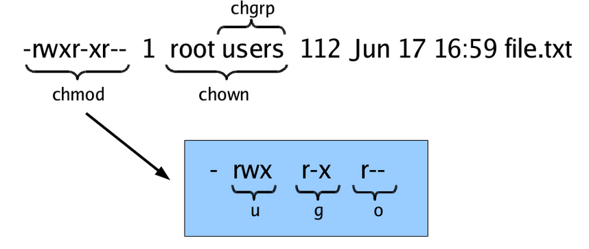

# 1 Overview 

In Unix, almost "everything is a file". This means that a very wide
variety of input and output resources (e.g., documents, directories,
keyboards, hard drives, network devices) are streams of bytes available
through the filesystem interface. This means that the basic file
management tools are extremely powerful in Unix. Not only can you use
these tools to work with files, but you can also use them to monitor and
control many aspects of your computer.

A file typically has these attributes:

  - Name
  - Type
  - Location
  - Size
  - Protection (i.e., permissions on what can be done with the file)
  - Time, date, and user identification
  
These attributes are discussed further as part of [our consideration of file permissions](#4-file-permissions).

> **Prerequisite**
>
> If you're not familiar with moving between directories, listing files, or the structure of the filesystem, please see our [Basics of UNIX tutorial](https://berkeley-scf.github.io/tutorial-unix-basics#3-files-and-directories).

# 2 Finding files and navigating the filesystem

You can find files by name, modification time, and type:

```bash
$ find . -name '*.txt'  # find files named *.txt
$ find . -mtime -2      # find files modified less than 2 days ago
$ find . -type l        # find links
```

The `.` argument here indicates to find the file(s) in the current working directory and any subdirectories.


As usual for UNIX commands, you can get more information about the `find` command with:

```bash
$ man find
$ find --help
```

As discussed in our
[Basics of UNIX tutorial](https://berkeley-scf.github.io/tutorial-unix-basics#3-files-and-directories),
one uses `cd` to change directories. In addition to use of "cd -" to go back to the previous working directory, you can use the `pushd`, `popd`, and `dirs` commands if you would like to keep a stack of previous working directories rather than just the last one.

In each directory there are two special directories, `.` and `..`, which refer to the current directory and the parent of the current directory, respectively. One only sees these with `ls` if we use the `-a` flag to reveal hidden files.

```bash
$ ls -al
```

```
total 1489
drwxr-sr-x  7 paciorek scfstaff     31 Apr 21 16:39  ./
drwxr-sr-x 19 paciorek scfstaff     30 Feb 28 15:07  ../
```

We saw the use of `.` above with `find`.

# 3 Filename globbing

Shell file globbing will expand certain special characters (called
wildcards) to match patterns of filenames, before passing those
filenames on to a program. Note that the programs themselves don't know
anything about wildcards; it is the shell that does the expansion, so
that programs don't see the wildcards. The following table shows some of
the special characters that the shell uses for expansion.

**Table. Filename wildcards**

<table>
<thead>
<tr class="header">
<th align="left">Wildcard</th>
<th align="left">Function</th>
</tr>
</thead>
<tbody>
<tr class="odd">
<td align="left"><code>*</code></td>
<td align="left">Match zero or more characters.</td>
</tr>
<tr class="even">
<td align="left"><code>?</code></td>
<td align="left">Match exactly one character.</td>
</tr>
<tr class="odd">
<td align="left"><code>[characters]</code></td>
<td align="left">Match any single character from among <em>characters</em> listed between brackets.</td>
</tr>
<tr class="odd">
<td align="left"><code>[!characters]</code></td>
<td align="left">Match any single character other than <em>characters</em> listed between brackets.</td>
</tr>
<tr class="odd">
<td align="left"><code>[a-z]</code></td>
<td align="left">Match any single character from among the range of characters listed between brackets.</td>
</tr>
<tr class="odd">
<td align="left"><code>[!a-z]</code></td>
<td align="left">Match any single character from among the characters not in the range listed between brackets</td>
</tr>
<tr class="odd">
<td align="left"><code>{frag1,frag2,...}</code></td>
<td align="left">Brace expansion: create strings frag1, frag2, etc.</td>
</tr>
</tbody>
</table>

List all files ending with a digit:

```bash
$ ls *[0-9]
```

Make a copy of `filename` as `filename.old`:

```{bash}
$ cp filename{,.old}
```

Remove all files beginning with *a* or *z*:

```bash
$ rm [az]*
```

List all the R code files with a variety of suffixes:

```bash
$ ls *.{r,R}
```

The `echo` command can be used to verify that a wildcard expansion will
do what you think it will:

```bash
$ echo cp filename{,.old}
cp filename filename.old
```

If you want to suppress the special meaning of a wildcard in a shell
command, precede it with a backslash (`\`). (Note that this is a general
rule of thumb in many similar situations when a character has a special
meaning but you just want to treat it as a character.) For example to
list files whose name starts with the `*` character:

```bash
$ touch \*test    # create a file called *test
$ ls \**
*test
```

To read more about standard globbing patterns, see the man page:

```
$ man 7 glob
```

# 4 File permissions

UNIX allows you to control who has access to a given file (or directory) and how the user can interact with the file (or directory). We can see what permissions are set using the `-l` flag to `ls`.

```bash
$ cd ~/stat243-fall-2020
$ ls -l  
```

```
total 152
drwxrwxr-x  2 scflocal scflocal  4096 Dec 28 13:15 data
drwxrwxr-x  2 scflocal scflocal  4096 Dec 28 13:15 howtos
drwxrwxr-x  2 scflocal scflocal  4096 Dec 28 13:15 project
drwxrwxr-x  2 scflocal scflocal  4096 Dec 28 13:15 ps
-rw-rw-r--  1 scflocal scflocal 11825 Dec 28 13:15 README.md
drwxrwxr-x 13 scflocal scflocal  4096 Dec 28 13:15 sections
-rw-rw-r--  1 scflocal scflocal 37923 Dec 28 13:15 syllabus.lyx
-rw-rw-r--  1 scflocal scflocal 77105 Dec 28 13:15 syllabus.pdf
drwxrwxr-x  2 scflocal scflocal  4096 Dec 28 13:37 units
```

When using the `-l` flag to `ls`, you'll see extensive information about each file (or directory), of which the most important are:

  - (column 1) file permissions (more later)
  - (column 3) the owner of the file ('scflocal' here)
  - (column 4) the group of users that the file belongs too (also 'scflocal' here)
  - (column 5) the size of the file in bytes
  - (column 6-8) the last time the file was modified
  - (column 9) name of the file
  
Here's a graphical summary of the information for a file named
"file.txt", whose owner is "root" and group is "users". (The graphic also indicates that the commands `chmod`, `chown`, and `chgrp` can be used to change aspects of the file permissions and ownership.)




Let's look in detail at the information in the first column returned by `ls -l`. 

```bash
$ ls -l
```

```
total 156
drwxrwxr-x  2 scflocal scflocal  4096 Dec 28 13:15 data
drwxrwxr-x  2 scflocal scflocal  4096 Dec 28 13:15 howtos
drwxrwxr-x  2 scflocal scflocal  4096 Dec 28 13:15 project
drwxrwxr-x  2 scflocal scflocal  4096 Dec 28 13:15 ps
-rw-rw-r--  1 scflocal scflocal 11825 Dec 28 13:15 README.md
drwxrwxr-x 13 scflocal scflocal  4096 Dec 28 13:15 sections
-rw-rw-r--  1 scflocal scflocal 37923 Dec 28 13:15 syllabus.lyx
-rw-rw-r--  1 scflocal scflocal 77105 Dec 28 13:15 syllabus.pdf
drwxrwxr-x  2 scflocal scflocal  4096 Dec 28 13:37 units
```

The first column actually contains 10 individual single-character columns. Items marked with a `d` as the first character are directories. Here `data` is a directory while `syllabus.pdf` is not.

Following that first character are three triplets of file permission information. Each triplet contains read ('r'), write ('w') and execute ('x') information. The first `rwx` triplet (the second through fourth characters) indicates if the owner of the file can read, write, and execute a file (or directory). The second `rwx` triplet (the fifth through seventh characters) indicates if anyone in the group that the file belongs to can read, write and execute a file (or directory). The third triplet (the eighth through tenth characters) pertains to any other user. Dashes mean that a given user does not have that kind of access to the given file.

For example, for the *syllabus.pdf* file, the owner of the file can read it and can modify the file by writing to it (the first triplet is `'rw-'`), as can users in the group the file belongs to. But for other users, they can only read it (the third triplet is `'r--'`).

We can change the permissions by indicating the type of user and the kind of access we want to add or remove. The type of user is one of:

   - 'u' for the user who owns the file,
   - 'g' for users in the group that the file belongs to, and
   - 'o' for any other users.

Thus we specify one of 'u', 'g', or 'o', followed by a '+' to add permission or a '-' to remove permission and finally by the kind of permission: 'r' for read access, 'w' for write access, and 'x' for execution access. 

As a simple example, let's prevent anyone from reading the `tmp.txt`
file (which we'll create first). We then try to print the contents of the file to the screen with the command `cat`, but we are denied.

First recall the current permissions:

```bash
$ echo "first line" > tmp.txt  # create a test text file that contains "first line"
$ ls -l tmp.txt
-rw-rw-r--  1 scflocal scflocal    11 Dec 28 13:39 tmp.txt
```
Now we remove the read permissions:

```bash
$ chmod u-r tmp.txt # prevent owner from reading
$ chmod g-r tmp.txt # prevent users in the file's group from reading
$ chmod o-r tmp.txt # prevent others from reading
$ ls -l tmp.txt
```
```
--w--w---- 1 scflocal scflocal 11 Dec 28 13:39 tmp.txt
```
```bash
$ cat tmp.txt
```
```
cat: tmp.txt: Permission denied
```           

That can actually be accomplished all at once, like this:

```bash
$ chmod ugo-r tmp.txt # prevent all three
$ ls -l tmp.txt
```
```
--w--w---- 1 scflocal scflocal 11 Dec 28 13:39 tmp.txt
```


Or if we wanted to remove read and write permission:

```bash
$ chmod ugo-rw tmp.txt # prevent all three
$ # The next command would usually add a line to the file, 
$ # but we don't have permission to write to it
$ echo "added line" >> tmp.txt  
```

```
-bash: tmp.txt: Permission denied
```

Now let's restore read and write permission to the owner:

```bash
$ chmod u+rw tmp.txt
$ echo "added line" >> tmp.txt
$ cat tmp.txt
```

```
first line
added line
```

There's lots more details that are important when making files accessible to other users, including:

  - [how to make files in a particular directory available to other users on the system](https://docs-research-it.berkeley.edu/services/high-performance-computing/user-guide/data/transferring-data/making-files-accessible/#making-files-accessible-to-all-other-savio-users) and 
  - [how to set up a directory for use by a UNIX group](https://docs-research-it.berkeley.edu/services/high-performance-computing/user-guide/data/transferring-data/making-files-accessible/#making-files-accessible-to-your-group-members), using the so-called "sticky bit" so that files created in the directory in the future belong to the group so that group members will readily have access to them by default.

# 5 Use simple text files when possible

UNIX commands are designed as powerful tools to manipulate text files. This means that it's helpful to store information in information in text files when possible (of course there are very good reasons to store large datasets in binary files as well, in particular speed of access to portions of the data and efficient storage formats). 

Furthermore, the basic UNIX commands that operate on files operate on a line by line basis (e.g., `grep`, `sed`, `cut`, etc.). So using formats where each line contains a distinct set of information (such as CSVs) is advantageous even compared to other text formats where related information is stored on multiple lines (such as XML and JSON).

# 6 Document formats and conversion

There are many plain text file formats (e.g., Markdown,
reStructuredText, LaTeX). Pandoc is a widely used document converter. To
convert a file written in markdown (`report.md`) to a PDF
(`report.pdf`), you would do something like:

    $ pandoc -o report.pdf report.md

For a quick introduction to LaTeX, please see the "Introduction to
LaTeX" tutorial and screencast here:
<http://statistics.berkeley.edu/computing/training/tutorials>
